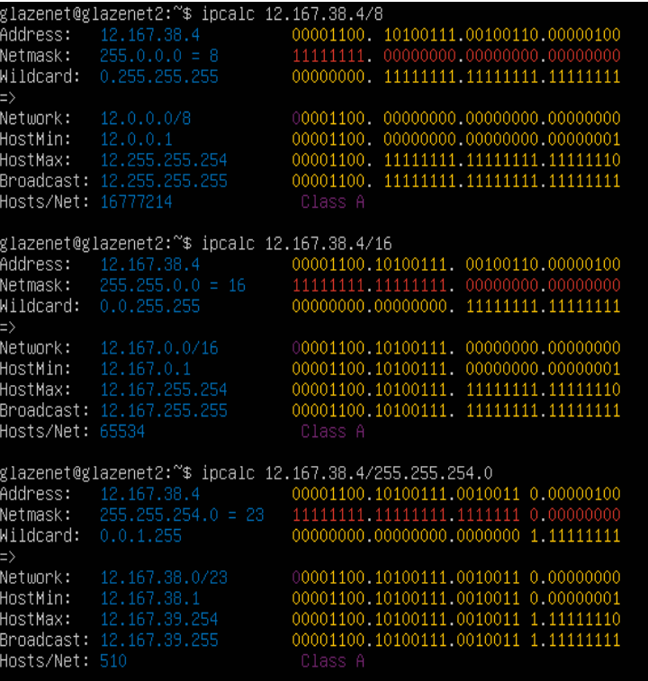
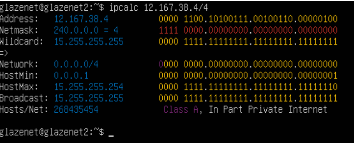
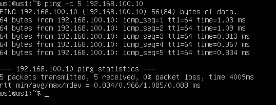
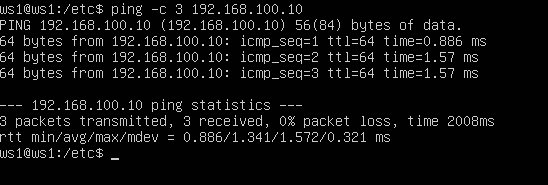
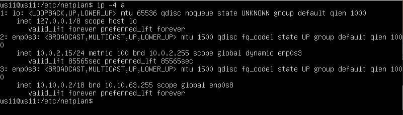
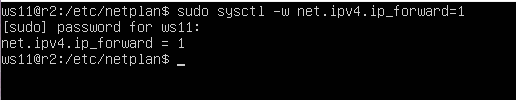
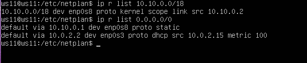
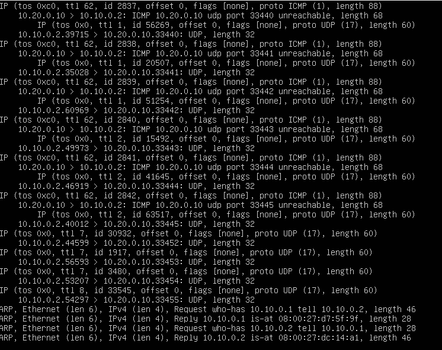
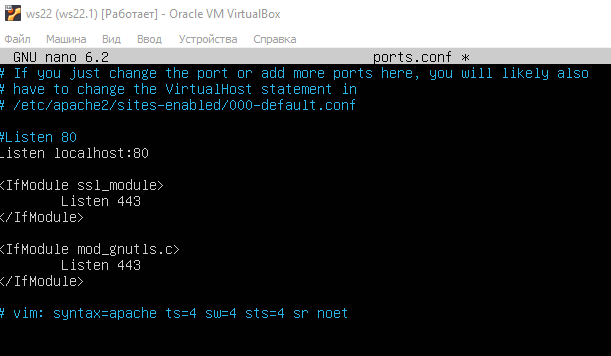

## Part 1. Инструмент ipcalc

- `ipcalc` - это утилита командной строки в Linux, которая используется для вычисления сетевых масок, подсетей, широковещательных адресов и других сетевых характеристик на основе заданного IP-адреса и маски.

### 1.1. Сети и маски

#### 1.1.1 Определяем адрес сети 192.167.38.54/13 с помощью команды: `ipcalc 192.167.38.54/13`
</img>

#### 1.1.2 Перевод маски: 
- `255.255.255.0` в префиксную и двоичную запись:

</img>

- `/15` в обычную и двоичную запись:

</img>

- `11111111.11111111.11111111.11110000` в обычную и префиксную:

</img>

#### 1.1.3 минимальный и максимальный хост в сети 12.167.38.4 при масках:
- 
  - `ipcalc 12.167.38.4/8`
  - `ipcalc 12.167.38.4/11111111.11111111.00000000.00000000`
  - `ipcalc 12.167.38.4/255.255.254.0`
  - `ipcalc 12.167.38.4/4`

</img>
</img>

### 1.2 localhost
Определить и записать в отчёт, можно ли обратиться к приложению, работающему на localhost, со следующими IP: 194.34.23.100, 127.0.0.2, 127.1.0.1, 128.0.0.1 .

- приложения к которым можно обратиться через localhost: 127.0.0.2, 127.1.0.1

</img>

- приложения к которым нельзя обратиться через localhost: 194.34.23.100, 128.0.0.1 

</img>

### 1.3 Диапазоны и сегменты сетей

#### 1.3.1 Определить и записать в отчёт какие из перечисленных IP можно использовать в качестве публичного, а какие только в качестве частных: 10.0.0.45, 134.43.0.2, 192.168.4.2, 172.20.250.4, 172.0.2.1, 192.172.0.1, 172.68.0.2, 172.16.255.255, 10.10.10.10, 192.169.168.1.

- к публичным относятся следующие IP адреса: 134.43.0.2, 172.0.2.1, 192.172.0.1, 172.68.0.2, 192.169.168.1
- к частным относятся следующие IP адреса: 10.0.0.45, 192.168.4.2, 172.20.250.4, 172.16.255.255, 10.10.10.10

</img>
</img>
</img>
</img>

#### 1.3.2 Определить и записать в отчёт какие из перечисленных IP адресов шлюза возможны у сети 10.10.0.0/18: 10.0.0.1, 10.10.0.2, 10.10.10.10, 10.10.100.1, 10.10.1.255

</img>

- из перечисленных IP адресов шлюзов у сети 10.10.0.0/18 возможны следующие: 10.10.0.2, 10.10.10.10, 10.10.1.255 .

## Part 2. Статическая маршрутизация между двумя машинами

#### 2.0.1 Поднимаем две виртуальные машины ws1 и ws2.

#### 2.0.1 С помощью команды ip a смотрим существующие сетевые интерфейсы
</img>
</img>

#### 2.0.3 Описать сетевой интерфейс, соответствующий внутренней сети, на обеих машинах и задать следующие адреса и маски: ws1 - 192.168.100.10, маска /16, ws2 - 172.24.116.8, маска /12

- С помощью следующей команды (аналогичная команда ip route или ip route) проверяем адреса машин

</img>
</img>

- Задаем адреса и маски

</img>

</img>

#### 2.0.4 Выполним команду netplan apply для перезапуска сервиса сети

</img>
</img>

С помощью следующей команды перепроверяем настройки

</img>
</img>

### 2.1. Добавление статического маршрута вручную

#### 2.1.1 Добавим статический маршрут от одной машины до другой и обратно при помощи команды вида ip r add

</img>
</img>

#### 2.1.2 Пропингуем соединение между машинами с помощью следующей команды: `ping -c 5 <IP-address>`

</img>
</img>

### 2.2. Добавление статического маршрута с сохранением
- Перезапустим машины, данные не сохранились

- Добавляем статический маршрут от одной машины до другой, редактируя файл `etc/netplan/00-installer-config.yaml`.

</img>
</img>

- Применяем новые настройки и пропингуем соединение между машинами

</img>
</img>

## Part 3. Утилита iperf3

### 3.1. Скорость соединения

Перевести и записать в отчёт:
- 8 Mbps (мегабит в секуду) = 1 MB/s (мегабайт в секунду)
- 100 MB/s (мегабайт в секунду) = 800 000 Kbps (килобит в секунду)
- 1 Gbps (гигабит в секунду) = 1 000 Mbps (мегабит в секунду)

### 3.2 Утилита iperf3

iperf3 — кроссплатформенная консольная клиент-серверная программа — генератор TCP и UDP трафика для тестирования пропускной способности в IP-сетях (поддерживает IPv4 и IPv6). С ее помощью довольно просто измерить максимальную пропускную способность сети между сервером и клиентом и провести нагрузочное тестирование канала связи. Поскольку утилита имеет как серверную часть так и клиентскую, надо рассматривать обе отдельно. Чтобы протестировать пропускную способность сети, вам нужно сначала подключиться к удаленной машине, которую вы будете использовать в качестве сервера. Затем на локальном компьютере, который рассматривается как клиент, нужно запустить iperf3 в клиентском режиме, используя флаг -c, и указать хост, на котором работает сервер (используя либо его IP-адрес, либо домен, либо имя хоста).

- Запускаем утилиту на ws1 в режиме сервер с флагом -s. Она будет ожидать пока не запустится этаже утилита на ws2 в режиме клиента.

</img>

- Следом запускаем на ws2 утилиту в режиме клиент с флагом -c и указываем IP-адрес ws1.

</img>

## Part 4. Сетевой экран

### 4.1. Утилита iptables

iptables — это утилита брандмауэра командной строки, которая использует цепочки политик для разрешения или блокировки трафика. Когда соединение пытается установиться в системе, iptables ищет правило в своем списке, чтобы сопоставить его. Если утилита не находит нужного правила, она прибегает к действию по умолчанию. Все сетевые пакеты, которые проходят через компьютер, отправляются компьютером или предназначены компьютеру, ядро направляет через фильтр iptables. Там эти пакеты поддаются проверкам и затем для каждой проверки, если она пройдена выполняется указанное в ней действие. Например, пакет передается дальше ядру для отправки целевой программе, или отбрасывается.

- Создаем файл /etc/firewall.sh, имитирующий фаерволл, на ws1 и ws2 с помощью команды `sudo touch /etc/firewall.sh`

- Добавляем в файл следующие правила согласно задания:
  - на ws1 применить стратегию когда в начале пишется запрещающее правило, а в конце пишется разрешающее правило (это касается пунктов 4 и 5).
  - на ws2 применить стратегию когда в начале пишется разрешающее правило, а в конце пишется запрещающее правило (это касается пунктов 4 и 5).
  - открыть на машинах доступ для порта 22 (ssh) и порта 80 (http).
  - запретить echo reply (машина не должна "пинговаться”, т.е. должна быть блокировка на OUTPUT).
  - разрешить echo reply (машина должна "пинговаться").

</img>
</img>

- Запустим файлы на обеих машинах 

</img>
</img>

Разница между стратегиями, применёнными в первом и втором файлах, заключается в следующем: в утилите iptables правила выполняются сверху вниз. На первой машине первым указано запрещающее правило на выход, поэтому она не сможет пропинговать другую машину. У второй машины, наоброт - первым указано разрешающее правило, значит она сможет пропинговать другую машину.

### 4.2. Утилита nmap

Эта программа помогает системным администраторам очень быстро понять какие компьютеры подключены к сети, узнать их имена, а также посмотреть какое программное обеспечение на них установлено, какая операционная система и какие типы фильтров применяются.

- Поиск машины, которая не "пингуется"

</img>

</img>

- Запускаем утилиту nmap командой (для проверки ищем в выводе nmap наличие строки Host is up)

</img>

- Сохраняем дампы образов виртуальных машин

</img>
</img>
</img>
</img>

## Part 5. Статическая маршрутизация сети

- Поднимаем пять виртуальных машин (3 рабочие станции (ws11, ws21, ws22) и 2 роутера (r1, r2)). Настроим сетевые адаптера.

</img>
</img>
</img>
</img>
</img>

- Настроить конфигурации машин в etc/netplan/00-installer-config.yaml согласно сети на рисунке.

</img>

</img>

</img>

</img>

</img>

- Перезапустить сервис сети. Если ошибок нет, то командой ip -4 a проверить, что адрес машины задан верно

</img>
</img>
</img>
</img>
</img>

- Пропинговать ws22 с ws21. Аналогично пропинговать r1 с ws11.

</img>
</img>

### 5.2. Включение переадресации IP-адресов.

- Для включения переадресации IP, выполните команду на роутерах: `sysctl -w net.ipv4.ip_forward=1`

</img>
</img>

- Откройте файл /etc/sysctl.conf и добавьте в него следующую строку: `net.ipv4.ip_forward = 1`

</img>
</img>

### 5.3. Установка маршрута по-умолчанию

- Настроить маршрут по-умолчанию (шлюз) для рабочих станций. Для этого добавить default перед IP роутера в файле конфигураций. Вызвать ip r и показать, что добавился маршрут в таблицу маршрутизации.

</img>
</img>
</img>

- Пропинговать с ws11 роутер r2 и показать на r2, что пинг доходит. Для этого использовать команду: `tcpdump -tn -i eth1`

</img>
</img>

### 5.4. Добавление статических маршрутов

- Добавить в роутеры r1 и r2 статические маршруты в файле конфигураций. Вызвать ip r и показать таблицы с маршрутами на обоих роутерах.

</img>
</img>

- Запустить команды на ws11: `ip r list 10.10.0.0/[маска сети] и ip r list 0.0.0.0/0`

</img>

Для адреса 10.10.0.0/18 был выбран маршрут, отличный от 0.0.0.0/0 (он попадает под маршрут по-умолчанию), т.к. машина ws11 соединена с сетью 10.10.0.0/18 по своему IP-адресу 10.10.0.2, для других адресов используется маршрут по умолчанию, который указан в файле 10.10.0.1.

### 5.5. Построение списка маршрутизаторов

- Запустим на r1 команду дампа: `tcpdump -tnv -i enp0s8`

</img>

- При помощи утилиты traceroute построим список маршрутизаторов на пути от ws11 до ws21.

</img>

Каждый пакет проходит на своем пути определенное количество узлов, пока достигнет своей цели. Причем, каждый пакет имеет свое время жизни. Это количество узлов, которые может пройти пакет перед тем, как он будет уничтожен. Этот параметр записывается в заголовке TTL, каждый маршрутизатор, через который будет проходить пакет уменьшает его на единицу. При TTL=0 пакет уничтожается, а отправителю отсылается сообщение Time Exceeded. Команда traceroute linux использует UDP пакеты. Она отправляет пакет с TTL=1 и смотрит адрес ответившего узла, дальше TTL=2, TTL=3 и так пока не достигнет цели. Каждый раз отправляется по три пакета и для каждого из них измеряется время прохождения. Пакет отправляется на случайный порт, который, скорее всего, не занят. Когда утилита traceroute получает сообщение от целевого узла о том, что порт недоступен трассировка считается завершенной.

### 5.6. Использование протокола ICMP при маршрутизации

- Запустим на r1 перехват сетевого трафика, проходящего через enp0s8 с помощью команды

</img>

- Пропингуем с ws11 несуществующий IP (например, 10.30.0.111) с помощью команды

</img>

- Сохраняем дампы образов виртуальных машин

## Part 6. Динамическая настройка IP с помощью DHCP

### 6.1 Настройка службы DHCP на r2

- Указать адрес маршрутизатора по-умолчанию, DNS-сервер и адрес внутренней сети

</img>

- В файле resolv.conf прописать nameserver 8.8.8.8

</img>

- Перезагрузить службу DHCP командой systemctl restart isc-dhcp-server

</img>

- Изменим настройки машин ws21 и ws22 в файле конфигурации, чтобы сделать протокол DHCP активным

</img>
</img>

- Проверяем присвоенный устройствам адрес

</img>
</img>

- Проверим соединение машины ws22 с ws21

</img>

- Указать MAC адрес у ws11, для этого в etc/netplan/00-installer-config.yaml надо добавить строки: `macaddress: 10:10:10:10:10:BA, dhcp4: true`

</img>

</img>

- Для r1 настроим аналогично r2, но выдачу адресов сделаем с жесткой привязкой к MAC-адресу (ws11).

</img>
</img>
</img>

- смотрим какой адрес назначен машине ws11

</img>

- Пропингуем соединение

</img>

Обновление ip адреса с помощью команды sudo dhclient.

- Проверяем IP до обновления

</img>

- Запросим с ws21 обновление ip адреса с помощью команды `sudo dhclient -v`

</img>

- Выполним команду для удаления старого IP адреса `sudo dhclient -r`

- Проверим IP адреса

</img>

В части 6 были использованы следующие опции DHCP протокола:
- option routers ip-address [, ip-address...]; - адреса шлюзов для клиентской сети. Маршрутизаторы должны быть перечислены в порядке предпочтительности.
- option domain-name-servers ip-address [, ip-address...]; - Список DNS серверов доступных клиенту. Сервера должны быть перечислены в порядке предпочтительности.

- Сохраняем дампы образов виртуальных машин

## Part 7. NAT

- В файле /etc/apache2/ports.conf на ws22 и r1 изменить строку Listen 80 на Listen 0.0.0.0:80, то есть сделать сервер Apache2 общедоступным

</img>
</img>

- Запустить веб-сервер Apache командой service apache2 start на ws22 и r1

</img>
</img>

- Добавить в фаервол, созданный по аналогии с фаерволом из Части 4, на r2 следующие правила:
  -  удаление правил в таблице filter - iptables -F
  - удаление правил в таблице "NAT" - iptables -F -t nat
  - отбрасывать все маршрутизируемые пакеты - iptables --policy FORWARD DROP

</img>

- Запустить firewall

</img>

- Проверить соединение между ws22 и r1 командой ping

</img>

</img>

- Добавить в файл ещё одно правило: разрешить маршрутизацию всех пакетов протокола ICMP. Запустить файл

</img>

</img>

- Проверить соединение между ws22 и r1 командой ping

</img>

</img>

- Добавить в файл ещё два правила
  - включить SNAT, а именно маскирование всех локальных ip из локальной сети, находящейся за r2 (по обозначениям из Части 5 - сеть 10.20.0.0)
  - включить DNAT на 8080 порт машины r2 и добавить к веб-серверу Apache, запущенному на ws22, доступ извне сети

SNAT изменяет частный IP-адрес исходного хоста на общедоступный IP-адрес. Он также может изменить исходный порт в заголовках TCP/UDP. SNAT обычно используется внутренними пользователями для доступа в Интернет.

DNAT используется, когда нам нужно перенаправить входящие пакеты с общедоступным адресом/портом на частный IP-адрес/порт внутри внутренней сети.

</img>
</img>

- Проверить соединение по TCP для SNAT, для этого с ws22 подключиться к серверу Apache на r1 командой: `telnet [адрес] [порт]`

</img>

- Проверить соединение по TCP для DNAT, для этого с r1 подключиться к серверу Apache на ws22 командой telnet (обращаться по адресу r2 и порту 8080)

</img>

- Сохраняем дампы образов виртуальных машин

## Part 8. Дополнительно. Знакомство с SSH Tunnels

- Запустить веб-сервер Apache на ws22 только на localhost (то есть в файле /etc/apache2/ports.conf изменить строку Listen 80 на Listen localhost:80)

</img>
</img>

Переадресация локального порта позволяет перенаправить порт на локальном компьютере (клиент ssh) на порт на удаленном компьютере (сервер ssh), который затем перенаправляется на порт на компьютере назначения. В этом типе переадресации клиент SSH прослушивает заданный порт и туннелирует любое подключение к этому порту к указанному порту на удаленном сервере SSH, который затем подключается к порту на целевом компьютере. Конечным компьютером может быть удаленный SSH-сервер или любой другой компьютер.

- Создаём соединение. Запускаем на машине ws22 соединения с ws21 `ssh 10.20.0.20`

</img>

- Оставаясь на машине ws22, устанавливаем соединение с сервером ws22 от машины ws21 `ssh -L 8080:127.0.0.1:80 10.20.0.20`

</img>

- Проверяем процессы на машине ws22 после создания соединения

</img>

- На машине ws21 запускаем утилиту telnet

</img>

Переадресация удаленного порта противоположна переадресации локального порта. Это позволяет перенаправить порт на удалённом компьютере (сервер ssh) на порт на локальном компьютере (клиент ssh), который затем перенаправляется на порт на компьютере назначения. В этом типе переадресации сервер SSH прослушивает заданный порт и туннелирует любое соединение с этим портом на указанный порт локального клиента SSH, который затем подключается к порту на целевом компьютере. Машина назначения может быть локальной или любой другой машиной. Удаленное перенаправление портов в основном используется для предоставления доступа к внутренней службе кому-то извне.

Установить прямое соединение с ws11 не получится, поскольку на r2 стоит фаервол, который не пропустит это соединение. В данном случае прокладовать соединение необходимо с ws11, сначала до r2 и только потом на ws22. Это возможно потому что, фаервол пропускает установленные соединения. Чтобы это сделать нужно будет воспользоваться командой `ssh -R`, которая позволяет соедениться со сторонним хостом.

- Начнем с соединения ws11 с r2:

</img>

- Затем соединяемся с ws22:

</img>

- Теперь у нас есть проложенное соединение от ws11 до ws22, что означает, что можно соединяться с ws11 на прямую с помощью команды: `sudo ssh -R 8080:localhost:80 ws11@10.10.0.10`

</img>

- Для проверки наличия подключения используем команду telnet 127.0.0.1 8080

</img>

- Сохраняем дампы образов виртуальных машин
